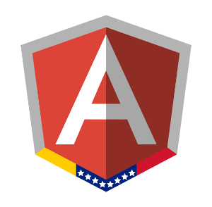

Title: Probando Angular, Experiencia de un Junior
Date: 2016-04-10 14:20
Category: Opinion
Tags: primeros, pasos, opinion
Slug:probando-angular-experiencia-junior
Author:JMEspiz
author_pic_url:https://s.gravatar.com/avatar/2766383c0d2f35d5fe8700a028881b7b?s=80&r=r
twitter:jmespiz
author_bio:Jr Dev and Personal IT
author_location:Valencia, Venezuela
Summary: ¿Pensando en iniciar en  Angular? En esta publicación podras leer la experiencia de un Junior que al igual que tu estaba pensando en iniciar en Angular
image: images/angular-bg-blue-300.png

Cuando eres un junior y comienzas en el mundo del desarrollo Web te veras agobiado por la enorme cantidad de herramientas, framework, lenguajes de programación, arquitecturas y más. Pero si te enfocas en un area en particular, como el Front End, esta inmensidad puede ser reducida considerablemente a tres tecnologias: **HTML5**, **CSS3** y **JavaScript**. No obstante, la epoca donde el Front End era solo una cara bonita termino hace mucho con la llegada de framework como Angular, que te permiten desarrollar poderosas aplicaciones del lado del cliente.

### ¿Qué es Angular?

Es un poderoso framework Javascript desarrollado y mantenido por google y la comunidad, que se basa en un arquitectura MV* que permite crear aplicaciones de una sola página (SPA - Single page Application).

### ¿Por qué vale la pena aprenderlo?

Como mencione anteriormente, la época en la que Front End era solo una cara bonita terminó. Cada vez hay mas alternativas para desarrollar e invertir tiempo en aprender este excelente framework puede abrirte muchas puertas y hacerte crecer más como desarrollador.

Cade destacar, que las ofertas laborales por Programadores que manejen AngularJS es muy extensa en diferentes países y con buena remuneración. Y es debido a que Angular forma parte de stack de tecnologias MEAN (Mongo - Express - Angular - Node) para desarrollar aplicaciones web usando javascript tanto en el Front End como en el Back End.

### Partes que en lo personal me gustaron.

- Organizar mejor tu código: Angular te permite modularizar tu aplicación en pequeños módulos que luego puedes reutilizar.
- El consumo de API's para desarrollar la aplicación se vuelve mucho mas sencillo.
- Crear elementos a la medida con las directivas.
- El uso de los filtros (filter), que me permiter desde formatear los datos hasta crear mis propios filtros que combinando con expresiones regulares pueden hacer cosas muy interesante como obtener las url de imagenes en un texto.
- La inyección de dependencias y módulos, que da una gran flexibilidad y moduralizacion.

### Partes que se me complicaron un poco.

La inyección de dependencias y la creacion de servicios para compartir datos fueron unos de los conceptos que mas difícil me parecieron al principio. Pero documentandome, viendo ejemplos al poco tiempo ya tenia una nocion sobre ellos y tambien entiendes lo indispensables que se vuelven. Otro aspecto que me pareció un poco complicado fue manejar las funciones $digest  y $apply para el two way data binding.

### Recomendaciones:

Una de las mejores formas de aprender es participar en pequeños proyecto para ir conociendo sus partes. Así como también, participar en comunidades es una excelente forma de aprender no solo Angular y de crecer como desarrollador, esto debido a que puedes aprender de muchos maestros Jedi que estan alli para compartir recursos, consejos, dudas e iniciar excelentes debates como por ejemplo ¿SEO en Angular?, sin duda una experiencia enriquecedora. En ngVenezuela te invitamos a formar parte de nuestra comunidad, seas un maestro Jedi o un joven padawan como yo. Además en nuestra comunidad tenemos proyectos para desarrollar, y que siempre estamos abiertos a recibir propuestas de nuevos proyectos y apoyarlos. Ven y comparte, aprende y disfruta de la comunidad de desarrolladores de este poderoso framework.

### Consíguenos en:

- [Google Groups](https://groups.google.com/forum/#!forum/ngvenezuela)
- [Twitter](http://twitter.com/ngVenezuela)
- [Github](https://github.com/ngVenezuela)
- [Telegram](https://telegram.me/ngvenezuela)
