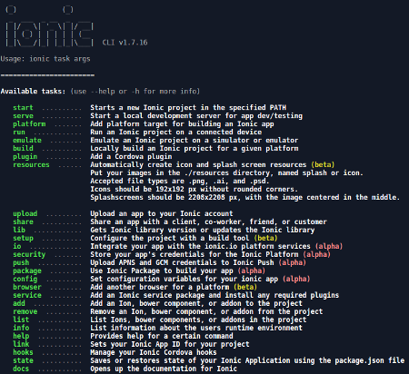
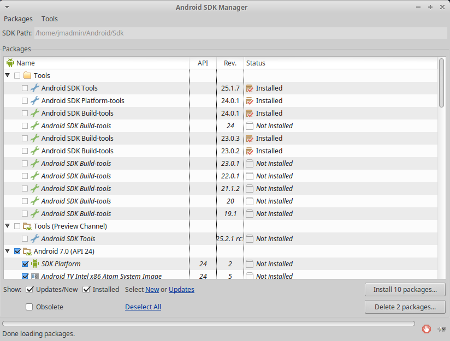
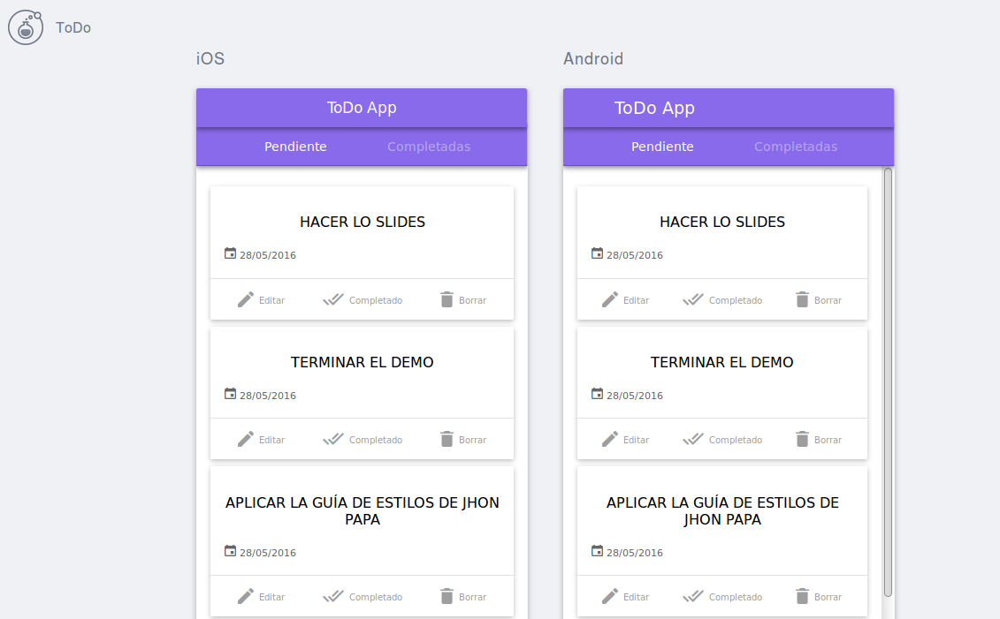
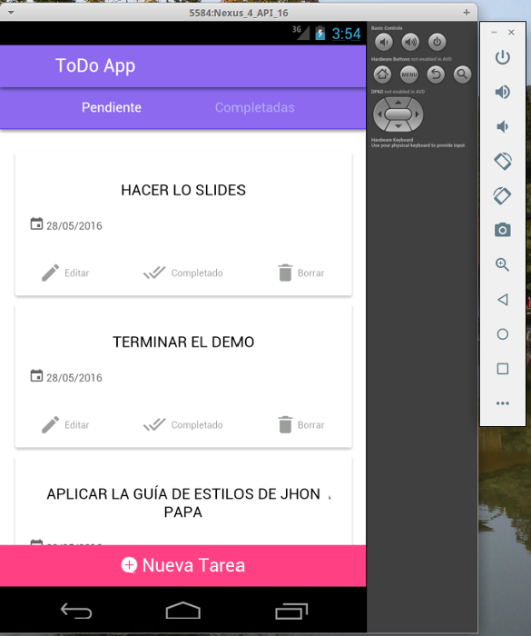

Title: Desarrollo Móvil con Ionic Framework: Parte I - Preparando Entorno
Date: 2016-04-10 14:20
Category: Tutorial
Tags: primeros, pasos, ionic, tutorail
Slug: desarrollo-movil-con-ionic-framework-parte-i
Author:JMEspiz
author_pic_url:https://s.gravatar.com/avatar/2766383c0d2f35d5fe8700a028881b7b?s=80&r=r
twitter:jmespiz
author_bio:Jr Dev and Personal IT
author_location:Valencia, Venezuela
Summary: Quieres aprender a desarrollar aplicaciones moviles hibridas y nos sabes por donde empezar, en este post puede conseguir un poco de orientación usando Ionic
image: images/angular-bg-blue-300.png

Saludos comunidad, en esta oportunidad es grato decirles que estaremos publicando una mini serie de posts hablando sobre el desarrollo móvil usando Ionic, comencemos.

### Que es Ionic Framework


Es un proyecto gratuito y open source, que ofrece una set de componentes HTML, CSS y JS optimizados para móvil, así tambien cuenta con herramientas que nos agilizarán nuestro desarrollo como la Ionic-CLI y Creator. Ionic hace uso de AngularJS y Sass, por lo que un conocimiento previo de los mismos nos ayudará a sacarle mayor provecho.


Ionic también emplea el proyecto [Apache Cordova](https://cordova.apache.org/) que nos permitirá empaquetar nuestra aplicaciones hechas con tecnologías web en su debido formato para el sistema operativo para el que estemos desarrollando, ejemplo, un .apk para Android.

Actualmente existen dos versiones: Ionic v1 basado en AngularJS (La versión de Ionic actual es la v1.3.1) e Ionic v2 basado en Angular (Actualmente se encuentra en beta, no obstante es usada por algunos en producción). En esta serie de posts nos centraremos en la v1 de Ionic y estará orientado al desarrollo hibrido en Android (para iOS el proceso es similar, solo difieren algunos parametros en los comandos).

Si quieres conocer un poco más de este proyecto no dudes en [visitar el sitio oficial](http://ionicframework.com/ ).

### Preparemos el Entorno

**Nota:** Estos pasos son validos para GNU/Linux y OS X. Para Windows ciertas condiciones aplican.


Lo primero que haremos será preparar nuestro entorno de desarrollo, el proceso es similar para ambas versión, con una ligera diferencia en un comando con npm. Lo que necesitaremos será nuestra amada terminal y las siguientes herramientas:

* NVM: Una increíble herramienta que nos dejará cambiar de versión de node sin problemas.
* Instalar Ionic y Cordova.
* Android SDK: Kit de desarrollo de Android provisto por Google. Con el SDK solo basta, pero hay quienes prefieren descargar el Android Studio completo y es también valido (incluso puede aportar más recursos).
* Agregar el ANDROID_HOME al PATH.
* Equipo para probar nuestra aplicación. Puede ser un dispositivo físico, si bajaron el Android Studio pueden configurar una AVD (Dispositivo virtual de Android) o Genymotion.

Empezemos:

### NVM: Node Versión Manager.

Esta excelente herramienta esta disponible en [github](https://github.com/creationix/nvm), donde encontraremos sus instrucciones de instalación. En mi caso que uso GNU/Linux están sencillo como correr alguno de estos comandos.
En el caso de usar cURL:

```bash
   $ curl -o- https://raw.githubusercontent.com/creationix/nvm/v0.31.4/install.sh | bash
```

o también con wget:

```bash
   $ wget -qO- https://raw.githubusercontent.com/creationix/nvm/v0.31.4/install.sh | bash
```

una vez instalado nvm con el script, hay dos formas que el sistema nos lo reconozca la primera vez:

1. Cerrando y abriendo la terminal.
2. Corriendo el comando:

```bash
 $ source ~/.bashrc #Si estas usando Bash o .zshrc si es Zsh
 ```

Para verificar que todo esta funcionado bien podemos correr el comando:

```bash
nvm --version #Que nos mostrara la versión de nvm
```

Ya con nvm funcionando visitamos la pagina oficial de node para ver sus versiones actuales y descargamos la versión LTS estable que para este momento es la v4.4.7 (también me gusta vivir al extremo pero como estamos aprendiendo “vamo a calmarno”).


para instalarla usamos el comando:

```bash
$ nvm install 4.4.7
$ nvm use 4.4.7 #para activarla
```

### Instalar Ionic y Cordova.


Nodejs viene con npm (Node package manager) un potente gestor de paquetes que nos permitirá instalar ionic y cordova desde la terminal. Para ello corremos el comando:

Ionic V1:
```bash
$ npm install -g cordova ionic
```

Ionic V2:
```bash
$ npm install -g ionic@beta
```

Para verificar que ionic esta instalado correctamente y tendremos a nuestra dispocisión la Ionic CLI, corremos el comando:
```bash
$ ionic #mostrará la versión de la CLI y las opciones disponibles.
```


### Android SDK - Android Studio

Para tener el Android SDK o Android Studio solo basta con ir a la [pagina web de desarrolladores](https://developer.android.com/studio/index.html#downloads) y descargar la versión para nuestro sistema operativo y descomprimirlo (Instalarlo en el caso de seleccionar Android Studio).

### Agregar el ANDROID_HOME al PATH.

Agregar variables al **PATH**, es la manera de decirle al sistema donde ubicar el ejecutable para comandos o script ejecutados desde la terminal, en nuestro caso nos interesa que Ionic CLI sepa donde esta ubicado el Android SDK para cuando nos toque compilar nuestra aplicación. Para este fin, definiremos la variable **ANDROID_HOME** en nuestro archivo .bashrc o .zshrc (Dependiendo de si estamos usando bash o Zsh).

Para ello desde la terminal corremos los siguientes comandos:

```bash
cd $HOME #para asegurarnos de estar en el Home
gedit .bashrc #use el editor al gusto, ya sea nano o vi. Flame War!!
```

y agregaremos las siguientes dos lineas al final:

```bash
export ANDROID_HOME="/ruta/al/Sdk" #ejemplo: “/home/usuario/Android/Sdk”
export PATH=${PATH}:$ANDROID_HOME/tools:$ANDROID_HOME/platform-tools
```

Guardamos y cerramos el archivo, para aplicar los cambios usamos el comando:

```bash
$ source .bashrc #o source .zshrc
```

Para verificar que nuestra variable esta funcionando, al correr el comando
```bash
$ android
```

debería mostrar el Android SDK Manager:



### Donde Probar mis Aplicaciones.

Con los pasos anteriores ya podemos comenzar a desarrollar nuestra aplicaciones híbridas. Ionic nos permite visualizar nuestra aplicaciones web en el navegador con el comando:

```bash
$ ionic serve
```

E incluso agregando el flag --lab podemos apreciar como se visualizaría en dispositivos iOS y Android, gracias a Ionic Lab:

```bash
$ionic server --lab
```



Finalmente cuando necesitemos acceder a funcionalidades nativas del telefono como la cámara, siempre necesitaremos un equipo físico o en su defecto un emulador. Android Studio les permitirá crear un emulador facilmente o incluso pueden usar el que les provee [Genymotion](https://www.genymotion.com) que tiene mejor perfomance y dispone de un plan gratuito para uso personal.



Te gustaría colaborar con la comunidad, con algún articulo para esta serie o algun otro tópico. Contactanos.

### Consíguenos en:

- [Google Groups](https://groups.google.com/forum/#!forum/ngVenezuela)
- [Twitter](http://twitter.com/ngVenezuela)
- [Github](https://github.com/ngVenezuela)
- [Telegram](https://telegram.me/ngVenezuela)
