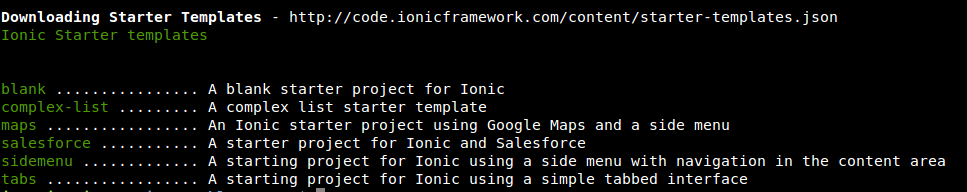
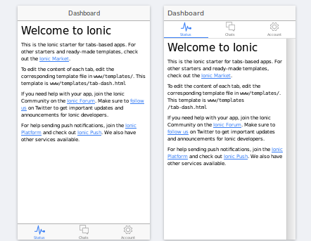
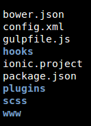

Title: Desarrollo Móvil con Ionic Framework: Parte II - Estructura de Un Proyecto
Date: 2016-09-27 17:00
Category: Tutorial
Tags: primeros, pasos, ionic, tutorial
Slug: desarrollo-movil-con-ionic-framework-parte-ii
Author:JMEspiz
author_pic_url:https://s.gravatar.com/avatar/2766383c0d2f35d5fe8700a028881b7b?s=80&r=r
twitter:jmespiz
author_bio:Jr Dev and Personal IT
author_location:Valencia, Venezuela
Summary: Quieres aprender a desarrollar aplicaciones moviles hibridas y nos sabes por donde empezar, en este post puede conseguir un poco de orientación usando Ionic
image: images/angular-bg-blue-300.png

Saludos comunidad, lamento la tardanza entre este post y el anterior. Continuando con nuestra serie de posts hablando sobre el desarrollo móvil usando Ionic, en esta oportunidad veremos como iniciar un proyecto en Ionic y conocer la estructura del mismo.

### Iniciando un Proyecto


En el [post anterior](http://ngvenezuela.org.ve/blog/desarrollo-movil-con-ionic-framework-parte-i.html) les comentaba como preparar el entorno para poder desarrollar aplicaciones híbridas usando Ionic, ahora vamos a iniciar un pequeño proyecto para conocer un poco de su estructura.

Para empezar, Ionic nos permite levantar todo la estructura básica para nuestros proyecto el comando *ionic start* y pasándole como argumentos el nombre de nuestro proyecto y la plantilla base que usaremos, esto es solo parte de las bondades de la ionic CLI. 

```bash
   $ ionic start nombreProyecto plantilla
```

Existen más parámetros disponibles que puede en consultar el comando *ionic start -h* para obtener mas información. Una plantilla (de ahora en adelante la llamaré template), es una aplicación base que ya tiene definidas rutas, secciones y ciertos elementos visuales que hacen referencia al sistema operativo para el que vamos a desarrollar la app. para visualizar cuales son los template disponibles solo nos basta con correr el siguiente comando:

```bash
   $ ionic start --list
```

y tendremos la siguiente salida:


Anteriormente solo estaban disponibles blank, tabs y sidemenu. Ahora contamos con tres template más. Vamos un poco a la practica para entender mejor. Una consideración que debes tener en cuenta es que para iniciar un proyecto en ionic debes contar con internet debido a que el comando *ionic start* baja desde Github todo los necesario como la App Base y el template que especifiquemos. Así que si sientes curiosidad no dudes en visitar la cuenta de en [Github](https://github.com/driftyco) y si te gusta el proyecto su merecida estrella :).

### Ionic CLI

Nos apoyaremos en la ionic CLI para comenzar nuestro proyecto de prueba y conocer la estructura, a medida que vayas adentrándote en ionic veras que su CLI es una herramienta poderosa que te facilitará muchas tareas. Let's do it..!!

```bash
   $ ionic start demo tabs
```

El terminar de armar tu proyecto la CLI te ofrecerá información de interés como los comandos para correr la App. Asimismo, te preguntará si deseas crear una cuenta en ionic.io para notificaciones push y usar Ionic View. Por el momento no nos interesa así que le responderemos que no y entramos en la carpeta del proyecto.

```bash
   $ Create an ionic.io account to send Push Notifications and use the Ionic View app?(Y/n): n
   $ cd demo
   $ ionic serve --lab #si deseas visualizar nuestra app base en el browser.
```

Si corrimos el ultimo comando y visitamos (El browser se abre automáticamente)  la dirección **http://localhost:8000** podremos ver nuestra App recién hecha.




Veamos la estructura del proyecto:



- bower.json: aquí se definen las dependencias que usará nuestro proyecto, manejadas por el gestor de paquetes [Bower](https://bower.io/).
- config.xml: Archivo de configuración de Cordova, nos apoyaremos en la ionic CLI para autogenerar unas lineas como por ejemplo para especificar logo y splashscreen, la plataforma para la que desarrollamos.
- gulpfile.js: nuestro archivo de gulp con una tareas preconfiguradas como la de recargar el navegador luego de cada cambio o compilar nuestro sass, por ejemplo.
- hooks: en este directorio están todos los scripts encargados de interactuar con Cordova para el proceso de compilación de nuestra aplicación. no es necesario modificarla.
- ionic.project: archivo con información de nuestro poryecto como el nombre y APP_ID
- package.json: nuestro archivo paquetes de dependecias manejadas por NPM.
- puglins: En este directorio se almacenaran todos los plugins que instalemos para usar en nuestra app. su contenido se autogenera con la ionic CLI.
- scss: en este directorio podemos colocar nuestros archivos [Sass](http://sass-lang.com/) un poderoso preprocesador de CSS para jugar con los estilos de nuestra App.
- www: En este directorio esta toda nuestra App, es donde estaremos trabajando todo el tiempo. En ella podemos encontrar sub-directorios como:
    - css: Para los estilos custom para nuestra App.
    - js: para la lógica de nuestro proyecto.
    - img: Para imágenes xD.
    - lib: aquí encontraremos las librerías de ionic y a su vez agregar otras de terceros que podríamos usar.
    - template: directorio con las vistas de nuestra app.

Existen dos directorios adicionales muy importantes, pero no generan hasta que agreguemos las plataformas para las que vamos a desarrollar. para eso nuevamente nos apoyaremos en al ionic CLI y correremos el siguiente comando:

```bash
   $ ionic platform add android #para agregar la plaforma Android.
```
*recuerda que todo se descarga desde github así que es esencial contar con conexión a internet*

Esto agregará la plataforma android a nuestro proyecto (esencial para cuando deseemos compilar nuestra App) y nos creará los directorios:

- platforms: En este directorio encontrarás todos los archivos de la aplicación en nativo de las plataformas para las que estemos desarrollando. No es necesario editar, al menos que se desee lograr un hack. cabe destacar que dentro de este directorio encontrarán el archivo platforms.js donde estarán definidas las plataformas y las versiones soportadas, este se va autogenerando con la ionic CLI.

-resources: en este directorio encontraremos los recursos gráficos para la compilación de nuestra App como lo son el *Icono* y *Splash*. en sus respectivas medidas para soportar diferentes tamaños de pantalla.


Y esta es la estructura de directorios básica de una aplicación hecha en ionic, espero les sea de mucha ayuda. Puedes consultar esta información en la [documentación oficial de ionic](http://ionicframework.com/docs/concepts/structure.html). En la siguiente parte comenzaremos una pequeña App para conocer más sobre ionic.

Si quieres conocer un poco más de este proyecto no dudes en [visitar el sitio oficial](http://ionicframework.com/ ). Te gustaría colaborar con la comunidad, con algún articulo para esta serie o algun otro tópico. Contactanos.

### Consíguenos en:

- [Google Groups](https://groups.google.com/forum/#!forum/ngVenezuela)
- [Twitter](http://twitter.com/ngVenezuela)
- [Github](https://github.com/ngVenezuela)
- [Telegram](https://telegram.me/ngVenezuela)
